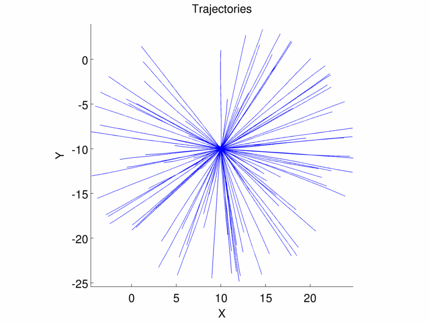
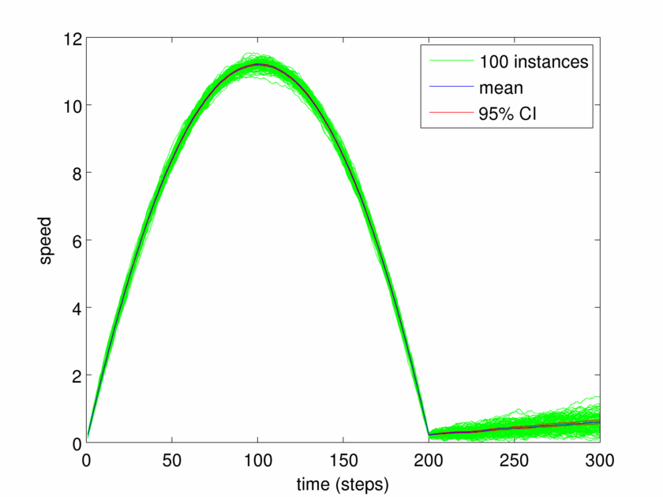

Testing RSE
-----------

See tests.cpp and plot_rse_speeds.m.

100 random starting points on a sphered are selected and the trajectories using the RSE are computed. 
The target is set to (10.0,-10.0,10.0)

