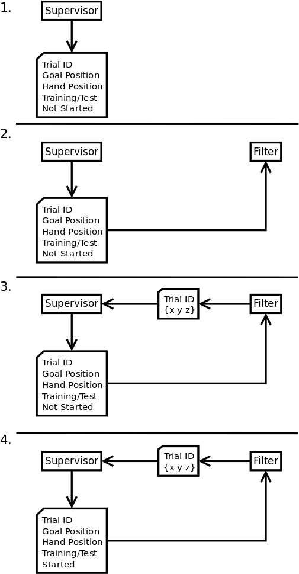
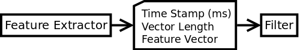
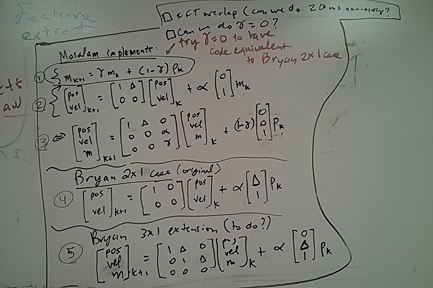

The Filter Module
=================

Filter interacts with two other modules, Supervisor and FeatureExtractor. This readme explains these connections. 

The benefits of this design:
----------------------------
* the modules run asynchronously
* while Filter still knows the time features were extracted
* and supervisor does not start a new trial without the confirmation of Filter

Supervisor-Filter Interaction
=============================

In the following scenario the Supervisor module is started first, in case Filter is started first, Filter simple waits for a message from Supervisor and then from Step 2 the process starts.

* Step 1: Supervisor starts broadcasting [ Trial ID (an integer), Goal Position (float:x,y,z), Hand Position (float:x,y,z), Whether a Training or Test trial is going to start (an integer), trial has NOT been started].
* Step 2: The Filter process starts and receives the published packet from Supervisor.
* Step 3: Filter publishes [Trial ID (the latest ID it had seen), float:x,y,z (the amount of movement in the three directions)]
* Step 4: Supervisor switches the trial status to Started, and keeps broadcasting the same packet as in Step 1. This process continues until the hand position controlled by Filter is close enough to the Goal position. Then Supervisor increments the Trial ID by one and goes to Step 1.

FeatureExtractor-Filter Interaction
===================================

The FeatureExtractor module continuously broadcasts the timestamped extracted features, [Timestamp (in milliseconds, unsigned integer), number of features (integer), features (float)]

Moving Average Filter
=============================

The moving average filter, originally implemented by Mosalam, averages power in the desired channels and power bands to control 1 or more dimensions. We were thinking along the lines of implementing the simplest filter needed to study the predictions made in Bryan's IEEE ITA Feb 2014 paper on Neural Shaping.

matlab filter working (6/17/14), cpp unknown
