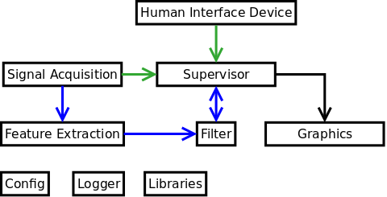

Directories
=======

libs -
+ the libraries / classes used by more than one module are in this directory.

feature_extraction_offline - 

feature_extraction_online - 
  + spectrogram - implements various spectrogram methods as listed at http://www.mathworks.com/help/signal/ref/spectrum.html
  + 

Modules
=======

The following diagram shows the main modules and the connections between them.

1. Signal Acquisition
---------------------

This modules interfaces the hardware. After grabbing the signal, it publishes the data using ZMQ at "ipc:///tmp/signal.pipe". The format of the messages is comma separated values (CSV), i.e., the value read from the first channel is followed by a comma, then the value of the second channel and so on.

Currently, two signal simulation modules are implemented. one uses stereo vision and the other uses kinect.

2. Feature Extraction
---------------------

The Feature Extraction module receives the output of the Signal Acquisition module from "ipc:///tmp/signal.pipe", parses and processes the data, and publishes the extracted features in the CSV format at "ipc:///tmp/features.pipe" using ZMQ. The first column is the timestamp in milliseconds, the seconds column is the number of features, and remaining columns are the features. This structure speeds up the processes that read the data from this pipe.

3. Supervisor
---------------------

This modules decides when a new trial starts and whether it is a training or test trial. Each trial has a unique ID. Supervisor publishes the trial ID, goal position, hand position, whether it is a training or test trial, and whether the trial has started at "ipc:///tmp/status.pipe". Supervisor at "ipc:///tmp/graphics.pipe" publishes the positions of the hand, the ball, and the target box, and the score/level.

4. Filter
---------------------

After reading the features (in the CSV format) from "ipc:///tmp/features.pipe" and the trial ID from Supervisor, this module publishes the predicted arm movement in the three dimensions at "ipc:///tmp/hand_position.pipe" (in the CSV format). Supervisor knows whether Filter is lagging behind by checking the trial ID published by Filter. 

5. Graphics
---------------------

The Graphics module receives the state of the game from "ipc:///tmp/graphics.pipe" published by Supervisor and updates the virtual environment.

How to compile and run
--------------
The required external libraries: (important: you always want to add the dev versions of these packages, because it includes header files needed for compiling)
1. ZMQ
2. Visual Python for the python graphics module
3. Openscenegraph for the C++ graphics module
4. openkinect and its python wrapper
5. opencv 2 or 3 and its python wrapper
6. IT++
7. Boost:  in Synaptic Package Manager, the exact name is libboost-math-dev (we have been using the most stable version, whatever version that is).
8. Armadillo - for linear algebra in matlab-like syntax
9. FLTK - used for making the popup window that lets you update the filter parameters while the game is running (FLTK is for creating GUIs)
10. install python-pip - Python installing program. needed to complete the ConfigObj installation. Use the Synaptic program to download.
11. ConfigObj - python library used by penn2/launcher/elam3.py in order to edit config files while keeping comment lines intact.
		to install, use this command: sudo pip install configobj (you probably can't install synaptic package manager for this)
		note that pip (python-pip) is the Python installing program, used to distribute packages in Python

To compile C++ modules use cmake, create a build subdirectory and in that directory run:
cmake ../
make
and then binary file is built. To run the modules, the order does not matter, go to each module's directory and run the binary or pyython script. 
